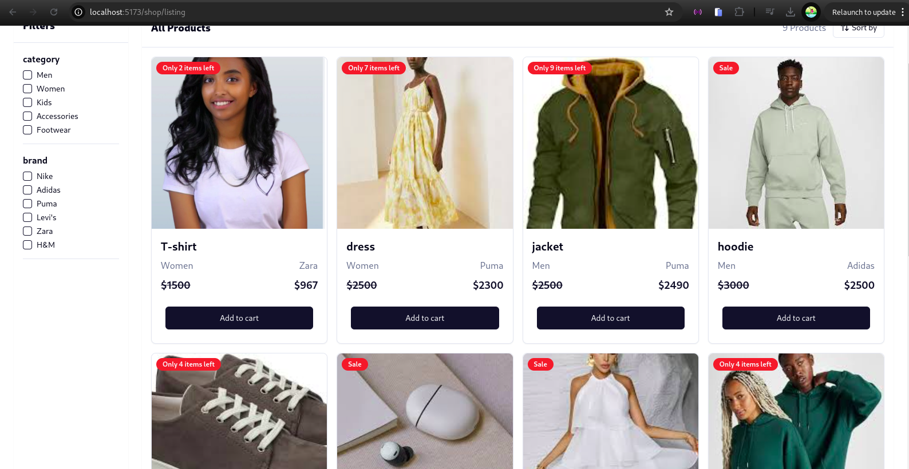
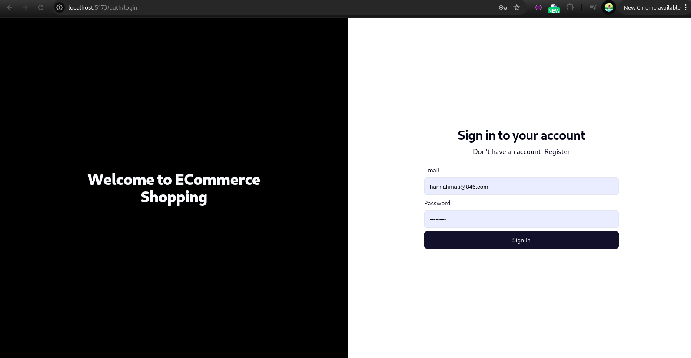
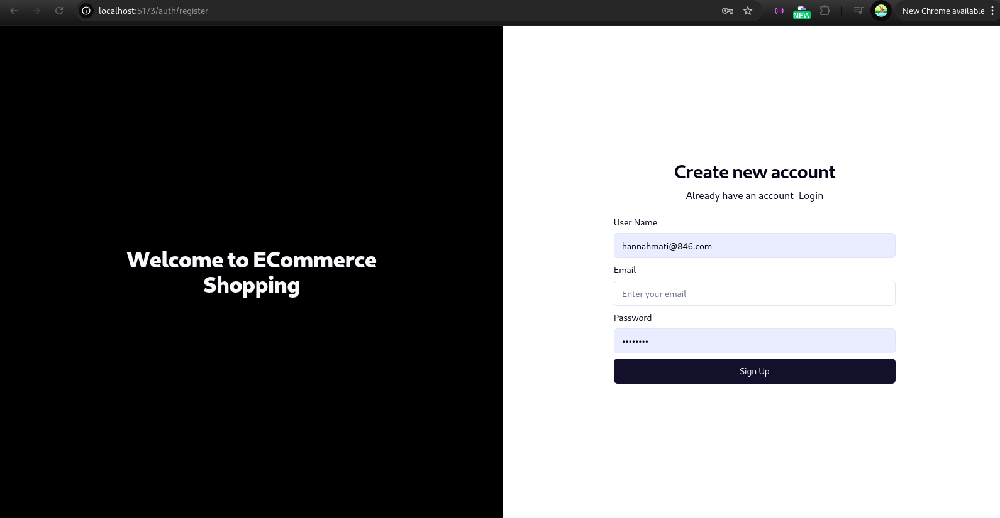

https://roadmap.sh/projects/ecommerce-api

## Run Locally

Clone the project

```bash
  git clone https://github.com/annah11/E-commerce
```

Go to the project directory

```bash
  cd client
```

Install dependencies

```bash
  npm install
```

Start the server

```bash
  npm run start
```

### Main Screen



### sign_in



### signup


